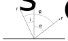

Surfaces Module (`sbpy.surfaces`)
=================================

The ``surfaces`` module describes the interaction of electromagnetic radiation with surfaces.  Sbpy uses the :math:`(i, e, \phi)` model (angle of incidence, angle of emittance, and phase angle) to describe how light scatters and emits light.  It has a flexible system that can incorporate any surface scattering model that can be described with these three angles.  A few built-in surface models are provided.

    Sbpy's geometric basis for surface scattering and emission: :math:`n` is the surface normal vector, :math:`r_s` is the radial vector to the light source, and :math:`r_o` is the radial vector to the observer.  The angle of incidence (:math:`i`), angle of emittance (:math:`e`), phase angle (:math:`\phi`) are labeled.

A instance of a ``Surface`` will have methods to calculate absorptance, emittance, and reflectance.  A radiance method is used to calculate the observed spectral radiance of a surface given incident light.

Surfaces are expected to require albedo and/or emissivity.  Conventions on which property is used and when should be defined by each class.  For example, a surface that only calculates reflectance may only require albedo, but one that calculates thermal emission may use the convention of albedo for absorbed sunlight and emissivity for emitted thermal radiation.

Built-in surface models
-----------------------

The model `~sbpy.surfaces.scattered.LambertianSurfaceScatteredSunlight` is used to observe sunlight scattered from a Lambertian surface (light scattered uniformly in all directions).

Create an instance of the ``LambertianSurfaceScatteredSunlight`` model, and calculate the absorptance, emittance, and reflectance for :math:`(i, e, \phi) = (30^\circ, 60^\circ, 90^\circ)`::

    >>> import astropy.units as u
    >>> import matplotlib.pyplot as plt
    >>> from sbpy.surfaces import LambertianSurfaceScatteredSunlight
    >>>
    >>> surface = LambertianSurfaceScatteredSunlight({"albedo": 0.1})
    >>>
    >>> i, e, phi = [30, 60, 90] * u.deg
    >>> surface.absorptance(i)  # doctest: +FLOAT_CMP
    <Quantity [0.77942286]>
    >>> surface.emittance(e, phi)  # doctest: +FLOAT_CMP
    <Quantity 0.5>
    >>> surface.reflectance(i, e, phi)  # doctest: +FLOAT_CMP
    <Quantity [0.04330127]>

Radiance of scattered/emitted light
^^^^^^^^^^^^^^^^^^^^^^^^^^^^^^^^^^^

All `~sbpy.surfaces.surface.Surface` models have a :meth:`~sbpy.surfaces.surface.Surface.radiance` method that calculates the radiance of scattered/emitted light, given the spectral flux density of incident light at the surface::

    >>> F_i = 1000 * u.W / u.m**2 / u.um  # incident spectral flux density
    >>> surface.radiance(F_i, i, e, phi)  # doctest: +FLOAT_CMP
    <Quantity [43.30127019] W / (sr um m2)>

Radiance of scattered sunlight
^^^^^^^^^^^^^^^^^^^^^^^^^^^^^^

``LambertianSurfaceScatteredSunlight`` is derived from the ``ScatteredSunlight`` class, which provides convenience methods for calculating the radiance of sunlight scattered off the surface::

    >>> wave = 0.55 * u.um
    >>> rh = 1 * u.au  # heliocentric distance of the surface
    >>> surface.scattered_sunlight(wave, rh, i, e, phi)  # doctest: +FLOAT_CMP
    <Quantity [81.34078653] W / (sr um m2)>

The solar spectrum is configured using Sbpy's calibration system.  See :doc:`calib` for details.

Radiance from vectors
^^^^^^^^^^^^^^^^^^^^^

As an alternative to using :math:`(i, e, \phi)`, radiance may be calculated using vectors that define the normal direction, radial vector of the light source, and radial vector of the observer::

    >>> # the following vectors are equivalent to (i, e, phi) = (30, 60, 90) deg
    >>> n = [1, 0, 0]
    >>> rs = [0.866, 0.5, 0] * u.au
    >>> ro = [0.5, -0.866, 0] * u.au
    >>>
    >>> surface.radiance_from_vectors(F_i, n, rs, ro)  # doctest: +FLOAT_CMP
    <Quantity [43.30190528] W / (sr um m2)>
    >>> surface.scattered_sunlight_from_vectors(wave, n, rs, ro)  # doctest: +FLOAT_CMP
    <Quantity [81.34555875] W / (sr um m2)>

Notice that heliocentric distance was not needed in the call to ``scattered_sunlight_from_vectors`` because it was already accounted for by the ``rs`` vector.

Building your own surface models
--------------------------------

Defining your own surface model is typically done by creating a new class based on `~sbpy.surfaces.surface.Surface`, and defining methods for ``absorptance``, ``emittance``, and ``reflectance``.  The `~sbpy.surfaces.lambertian.Lambertian` model serves as a good example.  For surface scattering problems, most users will combine their class with the `~sbpy.surfaces.scattered.ScatteredLight` or `~sbpy.surfaces.scattered.ScatteredSunlight` classes, which provide the ``radiance`` method to complete the ``Surface`` model.

Here, we define a new surface model with surface scattering proportional to :math:`\cos^2` based on the `~sbpy.surfaces.scattered.ScatteredSunlight` class::

    >>> import numpy as np
    >>> from sbpy.surfaces import Surface, ScatteredSunlight
    >>>
    >>> class Cos2SurfaceScatteredSunlight(ScatteredSunlight):
    ...     """Absorption and scattering proportional to cos**2."""
    ...
    ...     def absorptance(self, i):
    ...         return (1 - self.phys["albedo"]) * np.cos(i)**2
    ...
    ...     def emittance(self, e, phi):
    ...         return np.cos(e)**2
    ...
    ...     def reflectance(self, i, e, phi):
    ...         return self.phys["albedo"] * np.cos(i)**2 * self.emittance(e, phi)
    >>>
    >>> surface = Cos2SurfaceScatteredSunlight({"albedo": 0.1})
    >>> surface.reflectance(i, e, phi)  # doctest: +FLOAT_CMP
    <Quantity [0.01875]>
    >>> surface.radiance(F_i, i, e, phi)  # doctest: +FLOAT_CMP
    <Quantity [18.75] W / (sr um m2)>
    >>> surface.scattered_sunlight(wave, rh, i, e, phi)  # doctest: +FLOAT_CMP
    <Quantity [35.22159375] W / (sr um m2)>

However, if a scattering model will be re-used with other classes, e.g., for scattered light and thermal emission modeling, then the most flexible approach is to base the model on ``Surface`` and have derived classes combine the model with scattering or thermal emission classes::

    >>> class Cos2Surface(Surface):
    ...     """Abstract base class for absorption and scattering proportional to cos**2.
    ...
    ...     We document this as an "abstract base class" because the ``radiance``
    ...     method required by ``Surface`` is not implemented here, and therefore
    ...     this class cannot be used directly (i.e., it cannot be instantiated).
    ...
    ...     """
    ...
    ...     def absorptance(self, i):
    ...         return (1 - self.phys["albedo"]) * np.cos(i)**2
    ...
    ...     def emittance(self, e, phi):
    ...         return np.cos(e)**2
    ...
    ...     def reflectance(self, i, e, phi):
    ...         return self.phys["albedo"] * np.cos(i)**2 * self.emittance(e, phi)
    >>>
    >>> class Cos2SurfaceScatteredSunlightAlt(Cos2Surface, ScatteredSunlight):
    ...     """Absorption and scattering proportional to cos**2.
    ...
    ...     This class combines the ``absorptance``, ``emittance``, and ``reflectance``
    ...     methods from ``Cos2Surface`` with the ``radiance`` and ``scattered_sunlight``
    ...     methods of ``ScatteredSunlight``.
    ...
    ...     Parameters
    ...     ...
    ...     """
    >>>
    >>> class Cos2SurfaceThermalEmission(Cos2Surface, ThermalEmission):  # doctest: +SKIP
    ...     """Absorption and thermal emission proportional to cos**2.
    ...
    ...     This class combines the ``absorptance``, ``emittance``, and ``reflectance``
    ...     from ``Cos2Surface`` with the ``radiance`` method of a fictitious
    ...     ``ThermalEmission`` class.
    ...
    ...     Parameters
    ...     ...
    ...     """

Thanks to their base classes (``Cos2Surface``, ``ScatteredSunlight``, and ``ThermalEmission``), the ``Cos2SurfaceScatteredSunlightAlt`` and ``Cos2SurfaceThermalEmission`` classes are complete and no additional code is needed, just documentation.

Reference/API
-------------
.. automodapi:: sbpy.surfaces
   :no-heading:
   :inherited-members:
