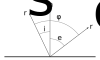

Surfaces Module (`sbpy.surfaces`)
=================================

Introduction
------------

.. admonition:: warning

    The surface module is being made available on a preview basis.  The API is
    subject to change.  Feedback on the approach is welcome.

The ``surfaces`` module describes the interaction of electromagnetic radiation with surfaces.  Sbpy uses the :math:`(i, e, \phi)` model (angle of incidence, angle of emittance, and phase angle) to describe how light scatters and emits light.  It has a flexible system that can incorporate any surface scattering model that can be described with these three angles.

    Sbpy's geometric basis for surface scattering and emission: :math:`n` is the surface normal vector, :math:`r_s` is the radial vector to the light source, and :math:`r_o` is the radial vector to the observer.  The angle of incidence (:math:`i`), angle of emittance (:math:`e`), phase angle (:math:`\phi`) are labeled.

An implementation of the ``Surface`` model has methods to calculate electromagnetic absorption, emission, and bidirectional reflectance.

Getting Started
---------------

Currently a Lambertian surface model is implemented.  A Lambertian surface scatters and emits light uniformly in all directions.

Create an instance of the ``LambertianSurface`` model, and calculate the absorption and bidirectional reflectance for :math:`(i, e, \phi) = (30^\circ, 60^\circ, 90^\circ)` and an albedo of 0.1 (emissivity of 0.9), given incident spectral flux density of 100 W m:superscript:`-2` μm:superscript:`-1`::

    >>> import astropy.units as u
    >>> from sbpy.surfaces import LambertianSurface
    >>>
    >>> surface = LambertianSurface()
    >>> i, e, phi = [30, 60, 90] * u.deg
    >>> albedo = 0.1
    >>> epsilon = 1 - albedo
    >>> F_i = 100 * u.W / u.m**2 / u.um
    >>> 
    >>> surface.absorption(F_i, epsilon, i=i)  # doctest: +FLOAT_CMP
    <Quantity 77.94228634 W / (um m2)>

Now calculate 10 μm emission from the same surface, assuming it is at a temperature of 200 K::

    >>> from sbpy.spectroscopy.sources import BlackbodySource
    >>>
    >>> bb = BlackbodySource(200 * u.K)
    >>> I_e = bb(10 * u.um, unit="W/(m2 um)")
    >>> I_e
    <Quantity 2.81280328 W / (um m2)>
    >>> surface.emission(I_e, epsilon, e=e, phi=phi)  # doctest: +FLOAT_CMP
    <Quantity 1.26576148 W / (um m2)>

Calculate the bidirectional reflectance for :math:`e=0`, and a range of incident angles::

.. plot::
    :context: reset
    :nofigs:

    >>> import numpy as np
    >>>
    >>> F_i = 100 * u.W / u.m**2 / u.um
    >>> e = 0 * u.deg
    >>> i = np.linspace(-90, 90) * u.deg
    >>> phi = np.abs(e - i)  # calculate phase angle
    >>> r = surface.reflectance(F_i, albedo, i=i, e=e, phi=phi)
    >>> r  # doctest: +FLOAT_CMP
    <Quantity [0.        , 0.20394184, 0.40704565, 0.60847681, 0.80740762,
               1.00302061, 1.19451198, 1.38109484, 1.56200248, 1.73649152,
               1.90384495, 2.06337507, 2.21442634, 2.35637805, 2.4886469 ,
               2.61068937, 2.72200396, 2.82213324, 2.91066578, 2.98723777,
               3.05153455, 3.10329193, 3.14229721, 3.16839012, 3.18146344,
               3.18146344, 3.16839012, 3.14229721, 3.10329193, 3.05153455,
               2.98723777, 2.91066578, 2.82213324, 2.72200396, 2.61068937,
               2.4886469 , 2.35637805, 2.21442634, 2.06337507, 1.90384495,
               1.73649152, 1.56200248, 1.38109484, 1.19451198, 1.00302061,
               0.80740762, 0.60847681, 0.40704565, 0.20394184, 0.        ] W / (sr um m2)>

.. plot::
    :include-source:
    :context:

    import matplotlib.pyplot as plt
    fig, ax = plt.subplots()
    ax.plot(i, r)
    ax.set(xlabel="$i$ (deg)", ylabel="$F_λ$ (W/m$^2$ μm)")

Using Vectors Instead of Angles
-------------------------------

As an alternative to using :math:`(i, e, \phi)`, results may be calculated using vectors that define the normal direction, radial vector of the light source, and radial vector of the observer::

    >>> # vectors equivalent to (i, e, phi) = (30, 60, 90) deg
    >>> n = [1, 0, 0]
    >>> r = [0.8660254, 0.5, 0] * u.au
    >>> ro = [0.5, -0.8660254, 0] * u.au
    >>>
    >>> surface.reflectance_from_vectors(F_i, epsilon, n=n, r=r, ro=ro)  # doctest: +FLOAT_CMP
    <Quantity 0.45 W / (um m2)>

Build Your Own Surface Models
-----------------------------

To define your own surface model create a new class based on `~sbpy.surfaces.surface.Surface`, and define the methods for ``absorption``, ``emission``, and ``reflectance``.  The `~sbpy.surfaces.lambertian.LambertianSurface` model serves as a reference.

Here, we define a new surface model with surface properties proportional to :math:`\cos^2`::

    >>> # use min_zero_cos(a) to ensure cos(a >= 90 deg) = 0
    >>> from sbpy.surfaces import Surface, min_zero_cos
    >>>
    >>> class Cos2Surface(Surface):
    ...     """Absorption and emission proportional to :math:`\cos^2`."""
    ...
    ...     def absorption(self, F_i, epsilon, i):
    ...         return F_i * epsilon * min_zero_cos(i)**2
    ...
    ...     def emission(self, I_e, epsilon, e, phi):
    ...         return I_e * epsilon * min_zero_cos(e)**2
    ...
    ...     def reflectance(self, F_i, albedo, i, e, phi):
    ...         return  * min_zero_cos(i)**2 * self.emission(e, phi)
    >>>
    >>> surface = Cos2Surface()
    >>> surface.reflectance(i, e, phi)  # doctest: +FLOAT_CMP
    <Quantity [0.01875]>
    >>> surface.radiance(F_i, i, e, phi)  # doctest: +FLOAT_CMP
    <Quantity [18.75] W / (sr um m2)>
    >>> surface.scattered_sunlight(wave, rh, i, e, phi)  # doctest: +FLOAT_CMP
    <Quantity [35.22159375] W / (sr um m2)>

Reference/API
-------------
.. automodapi:: sbpy.surfaces
   :no-heading:
   :inherited-members:
